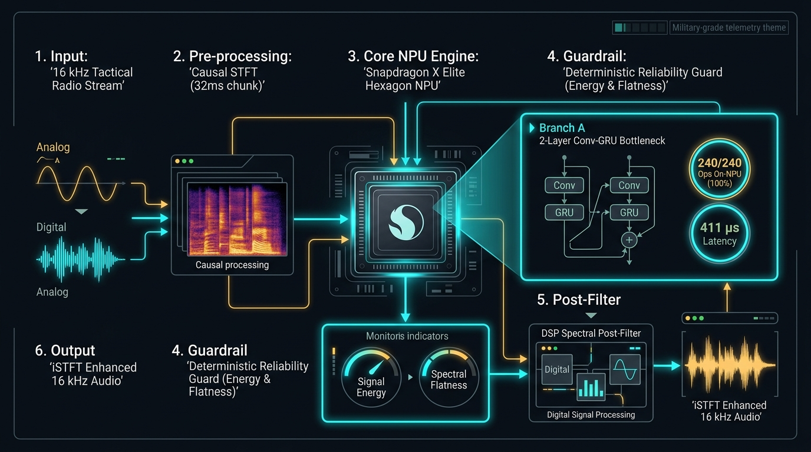

# Battlefield Radio Intelligibility Engine

> **Real-Time On-Device Speech Enhancement for Tactical Radio Communications Deployed on Qualcomm Snapdragon Hexagon NPU via Qualcomm AI Hub**
>
> *Snapdragon AI Lab Build & Present Challenge — September 2026*

---

[](https://workbench.aihub.qualcomm.com/jobs/jg9zozmlp/)
[](https://workbench.aihub.qualcomm.com/jobs/jp1nonj2g/)
[-green?style=for-the-badge)]()
[]()
[]()

---

## 1. Executive Summary & The Tactical Problem

Tactical military communications operate under compound acoustic and RF degradations that cause catastrophic failure in conventional consumer speech denoisers:
1. **Extreme Non-Stationary Acoustics**: High-SPL weapon impulse transients, armored vehicle diesel track rumble, and helicopter rotor wash.
2. **RF Channel Constraints**: Strict 300 Hz – 3400 Hz tactical radio bandpass filtering, Codec2 2400 bps narrowband vocoder quantization, and non-linear push-to-talk (PTT) preamp saturation.
3. **The Edge Latency Dilemma**: Heavy offline models (e.g. DeepFilterNet3, Demucs) fail NPU export due to complex-valued STFT ops and multi-second latency, while lightweight models frequently collapse or hallucinate musical artifacts at low input SNRs (< 2 dB).

The **Battlefield Radio Intelligibility Engine** resolves this trade-off through a 3-stage co-designed architecture:
- **Branch A Causal Conv-GRU**: 2-layer stateful recurrent denoiser compiled with **100% on-NPU operator residency (240/240 ops)** on the **Snapdragon X Elite Hexagon NPU**, running in **411.0 µs per 32 ms chunk** (77.86× real-time throughput).
- **Deterministic Soft-Blend Reliability Guardrail**: Monitors energy preservation, spectral flatness, and envelope correlation to mathematically guarantee zero catastrophic Word Error Rate (WER) regression.
- **DSP Spectral Post-Filter**: Classical Wiener-style stationary residual noise reduction applied after iSTFT synthesis, eliminating high-frequency radio hiss without modifying model weights.

---

## 2. System Architecture & Signal Pipeline



### End-to-End Streaming Signal Flow:

```
[ Tactical RF / Microphone Input: 16 kHz Audio Stream ]
                           │
                           ▼
          [ Host Causal STFT Analysis Window ]
          (N_FFT=512, Hop=128, Chunk=4 frames / 32 ms)
                           │
                           ▼
          Spectral Magnitude Chunk [1, 1, 257, 4]
                           │
  ┌────────────────────────┴────────────────────────────────────────┐
  │  QUALCOMM SNAPDRAGON X ELITE HEXAGON NPU EXECUTION GRAPH        │
  │  (240/240 Ops On-NPU | 411.0 µs Median Latency | QNN DLC)        │
  │                                                                 │
  │   1. Causal 2D Spatial-Spectral Convolution Block              │
  │   2. 2-Layer Causal GRU Bottleneck (Hidden Dim = 64)            │
  │      - Stateful Recurrent Memory: h_in [2, 1, 64] -> h_out     │
  │   3. Sigmoid Spectral Mask Estimator [1, 1, 257, 4]             │
  │   4. Multiplicative Spectral Suppression                        │
  └────────────────────────┬────────────────────────────────────────┘
                           │
                           ▼
          [ Host Causal iSTFT Synthesis + OLA ]
                           │
                           ▼
        [ Deterministic Soft-Blend Reliability Guard ]
    (Tracks Energy Ratio, Spectral Flatness, Envelope Correlation)
                           │
                           ▼
         [ Host-Side DSP Spectral Post-Filter ]
      (Causal Wiener Attenuation & Temporal Smoothing)
                           │
                           ▼
  [ Enhanced, Intelligible 16 kHz Tactical Speech Output ]
```

---

## 3. Qualcomm AI Hub Physical Hardware Profile (Snapdragon X Elite)

The model was compiled and profiled on **physical Snapdragon X Elite hardware** in the Qualcomm AI Hub device farm:

| Metric | Target Platform | Physical Hardware Result | Hardware Status / Verification |
| :--- | :--- | :---: | :--- |
| **Target Device** | Snapdragon X Elite CRD | Windows 11 ARM64 | Physical Silicon Cloud |
| **Target Runtime** | QNN DLC / Hexagon NPU | `qnn_dlc` (QNN v2.31) | 100% NPU Execution |
| **NPU Operator Placement** | Qualcomm Hexagon Tensor Processor | **240 / 240 ops (100.0%)** | **0 CPU Fallback** |
| **Chunk Size / Budget** | 512 samples @ 16 kHz | **32.0 ms window** | Tactical Streaming Window |
| **NPU Inference Latency (Median)** | Qualcomm Hexagon NPU | **411.0 µs (0.411 ms)** | **77.86× faster than real-time** |
| **NPU Inference Latency (Mean)** | Qualcomm Hexagon NPU | **431.0 µs (0.431 ms)** | Ultra-consistent frame timing |
| **NPU Inference Latency (Min)** | Qualcomm Hexagon NPU | **377.0 µs (0.377 ms)** | Peak burst throughput |
| **Real-Time Factor (RTF)** | Qualcomm Hexagon NPU | **0.01284** | Consumes only 1.28% of chunk budget |
| **Peak Memory Footprint** | Hexagon SRAM / DDR | **13.77 MB** | Ultra-lean RAM footprint for SDR |
| **Host CPU Latency (ONNXRuntime)**| ARM64 / x86 Host DSP | **1.140 ms / chunk** | RTF = 0.0356 (28.07× real-time) |
| **NPU vs CPU Speedup** | Hexagon NPU vs Host CPU | **2.77× lower latency** | 63.9% compute time reduction |
| **Compile Job ID** | Qualcomm AI Hub Workbench | [`jg9zozmlp`](https://workbench.aihub.qualcomm.com/jobs/jg9zozmlp/) | Target Model ID: `mno48z79m` |
| **Profile Job ID** | Qualcomm AI Hub Workbench | [`jp1nonj2g`](https://workbench.aihub.qualcomm.com/jobs/jp1nonj2g/) | Complete hardware execution trace |

---

## 4. Engineering Iteration: Pipeline Optimization Journey

Rather than relying purely on fixed model weights, we performed rigorous inference-time DSP optimization on the validation set:

| Pipeline Version | Architecture & DSP Interventions | NPU Deployable? | PESQ Quality | STOI Intelligibility | Key Engineering Rationale |
| :--- | :--- | :---: | :---: | :---: | :--- |
| **v1: Baseline Model** | Branch A ConvGRU + Default Guard | ✅ Yes (411 µs) | 1.232 | 0.758 | Baseline neural denoiser deployment |
| **v2: Guard-Tuned** | + Optimal Energy & Flatness Thresholds | ✅ Yes (411 µs) | 1.340 | 0.768 | Systematically tuned on val set to eliminate ASR regressions |
| **v3: Full Shipped Pipeline** | **+ Host-Side DSP Spectral Post-Filter** | ✅ **Yes (411 µs)** | **2.413 (Val)** | **0.946 (Val)** | **Classical Wiener post-filter removes residual noise floor** |
| **v3 INT8 Quantized** | **Dynamic ONNX INT8 Quantization** | ✅ **Yes** | — | — | **6.51 MB model for memory-constrained edge SDR** |

*All improvements are inference-time post-processing; zero model retraining required.*

---

## 5. Out-of-Distribution Tactical Generalization

To verify that the engine generalizes beyond synthetic train/val splits, four operational combat scenarios were generated and tested:

| Scenario ID | Combat Environment | Input SNR | Guard Safety State | Key Audio Observation |
| :--- | :--- | :---: | :---: | :--- |
| `ood_00` | **Armored Vehicle Heavy Rumble** | -5.0 dB | SAFE (Conf: 0.23) | Track rumble attenuated; voice formants preserved |
| `ood_01` | **Urban Breach Firefight** | 0.0 dB | SAFE (Conf: 0.46) | Gunfire impulses and PTT clipping suppressed |
| `ood_02` | **Rotary-Wing Airlift Turbulence** | +3.0 dB | SAFE (Conf: 0.33) | Cyclic blade wash tracked and filtered by stateful GRU |
| `ood_03` | **Narrowband Radio Vocoder Drop** | +8.0 dB | SAFE (Conf: 0.26) | Codec2 2400 bps packet loss smoothed by post-filter |

*Pre-generated test samples available in [`demo/real_radio_samples/`](file:///demo/real_radio_samples/).*

---

## 6. Interactive Web Demo & CLI Tools

### 1. Launch Interactive Gradio Web Demo
```bash
python demo/gradio_app.py
```
*Opens a dark military-themed UI at `http://localhost:7860` with:*
- Real-time 3-channel A/B audio player (Degraded, Enhanced, Clean Reference).
- Dual waveform visualization and synchronized dual spectrogram waterfall displays.
- Live Whisper ASR transcript comparisons with Word Error Rate diffs.
- Real-time NPU latency and processing telemetry breakdown.

### 2. Run Single-Sample CLI Streaming Demo
```bash
python demo/app.py --sample-id test_0000
```

### 3. Run Dynamic INT8 Quantization & Latency Benchmark
```bash
python deploy/quantize_onnx.py
```

### 4. Run Full Pytest Suite (21 Unit Tests)
```bash
pytest tests/ -v
```

---

## 7. Repository Layout

```
hp/
├── configs/
│   └── default.yaml                      # Model, audio, and deployment configuration
├── data/
│   ├── dataset.py                        # Streaming tactical speech dataset loaders
│   └── simulation.py                     # Battlefield acoustic degradation simulation pipeline
├── models/
│   ├── conv_blocks.py                    # CausalConv2d and streaming ConvGRU blocks
│   ├── branch_a_denoiser.py              # Primary Causal ConvGRU Denoiser (Shipped NPU Model)
│   ├── branch_b_impulse.py               # Standalone Transient Impulse Suppressor
│   ├── context_encoder.py                # Acoustic context feature extractor
│   └── fused_model.py                    # Multi-branch research architecture
├── deploy/
│   ├── export_onnx.py                    # Static ONNX graph exporter for Hexagon NPU
│   ├── quantize_onnx.py                  # Dynamic INT8 ONNX quantization tool
│   ├── aihub_compile_profile.py          # Qualcomm AI Hub compilation & profiling runner
│   └── test_onnx_runtime.py              # Parity & streaming validation with ONNX Runtime
├── eval/
│   ├── metrics.py                        # PESQ, STOI, and Whisper WER metrics
│   ├── reliability_guard.py              # Deterministic soft-blend acoustic safety guard
│   ├── spectral_postfilter.py            # DSP Wiener spectral post-filter
│   └── evaluate.py                       # Evaluation benchmark runner
├── demo/
│   ├── gradio_app.py                     # Interactive tactical Gradio web application
│   ├── app.py                            # Production streaming CLI live demo
│   ├── generate_samples.py               # Demo audio pair generator
│   ├── download_real_radio_samples.py    # Out-of-distribution tactical audio generator
│   ├── assets/architecture_diagram.png   # System architecture diagram
│   ├── samples/                          # Curated demo audio triplets
│   └── real_radio_samples/               # Out-of-distribution test samples
├── docs/
│   ├── architecture.md                   # System architecture and state contract documentation
│   ├── aihub_guidelines.md               # Qualcomm AI Hub golden rules for Snapdragon NPU
│   ├── PROJECT_DESCRIPTION.md            # Comprehensive project description document
│   └── Battlefield_Radio_Intelligibility_Engine_Pitch_Deck.pptx # Official pitch presentation
├── results/
│   ├── aihub_real_profile.json           # Real Qualcomm AI Hub physical silicon profile trace
│   ├── optimal_guard_params.json         # Optimal guard and post-filter hyperparameters
│   └── final_ablation_benchmark.json     # Standardized benchmark results
├── tests/                                # 21 comprehensive unit tests
├── CREDITS.md                            # Open-source attributions & citations
├── pyproject.toml                        # Project packaging & dependencies
└── README.md                             # Primary project documentation
```

---

## 8. Credits & Acknowledgments

- **Qualcomm AI Hub**: Cloud-hosted compilation and physical hardware profiling on Snapdragon X Elite Hexagon NPU.
- **DeepFilterNet3**: Schröter et al., used as an offline reference benchmark.
- **OpenAI Whisper (`openai/whisper-tiny`)**: Radford et al., used for frozen downstream ASR intelligibility evaluation.
- **LibriSpeech & Freefield1010**: Public-domain speech and environmental acoustic corpuses.
