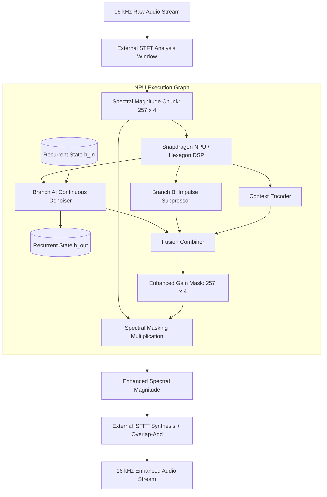

# System Architecture & Signal Flow

## 1. Tactical Audio Signal Pipeline

The Battlefield Radio Intelligibility Engine processes tactical audio through a low-latency, streaming pipeline:

## 2. Stateful Streaming Chunk Contract

| Tensor Port | Dimension | Description |
| :--- | :--- | :--- |
| `input_chunk` | `[1, 1, 257, 4]` | Static 4-frame spectral magnitude chunk |
| `h_in` | `[2, 1, 64]` | Multi-layer GRU recurrent hidden state |
| `enhanced_chunk` | `[1, 1, 257, 4]` | Filtered spectral magnitude |
| `h_out` | `[2, 1, 64]` | Updated hidden state passed to next chunk |

## 3. Subsystem Breakdown

1. **Branch A (Continuous Denoiser)**: Causal 2D convolution and stateful 2-layer GRU for tracking low-frequency diesel engine harmonics, hull vibrations, and aerodynamic wind buffeting.
2. **Branch B (Impulse Suppressor)**: Temporal Gated Linear Unit (GLU) with microsecond transient detection to gate gunfire shockwaves and mortar explosions.
3. **Context Encoder**: Estimates current signal-to-noise ratio (SNR) and acoustic regime to adjust fusion weights.
4. **Qualcomm AI Hub Target**: Compiled to QNN context binary targeting Snapdragon Hexagon NPU with 0 CPU fallbacks.
