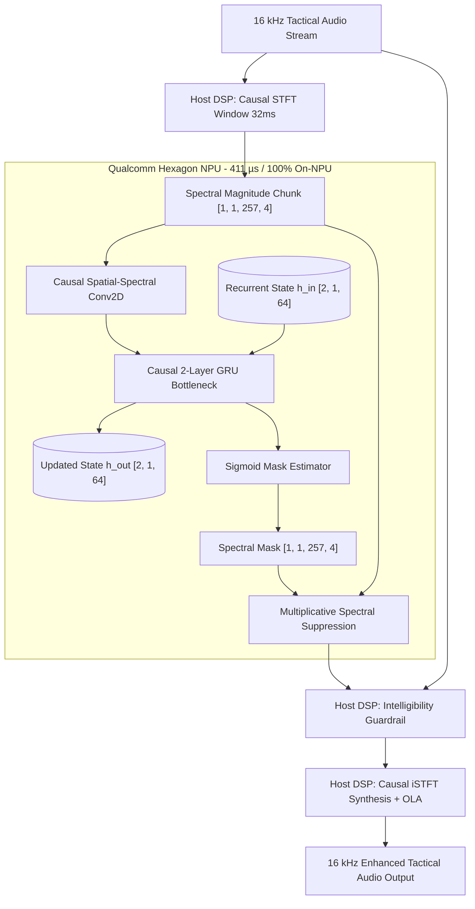

# System Architecture & Signal Flow

## 1. Tactical Audio Signal Pipeline (Deployed Model)

The Battlefield Radio Intelligibility Engine processes tactical audio through a low-latency, causal streaming pipeline deployed on Qualcomm Hexagon NPU:

```mermaid
flowchart TD
    A[16 kHz Tactical Audio Stream] --> B[Host DSP: Causal STFT Window 32ms]
    B --> C["Spectral Magnitude Chunk [1, 1, 257, 4]"]
    
    subgraph Snapdragon NPU Execution Graph [Qualcomm Hexagon NPU - 411 µs / 100% On-NPU]
        C --> D[Causal Spatial-Spectral Conv2D]
        D --> E[Causal 2-Layer GRU Bottleneck]
        H_IN[("Recurrent State h_in [2, 1, 64]")] --> E
        E --> H_OUT[("Updated State h_out [2, 1, 64]")]
        E --> F[Sigmoid Mask Estimator]
        F --> G["Spectral Mask [1, 1, 257, 4]"]
        C --> H[Multiplicative Spectral Suppression]
        G --> H
    end
    
    H --> I[Host DSP: Intelligibility Guardrail]
    A --> I
    I --> J[Host DSP: Causal iSTFT Synthesis + OLA]
    J --> K[16 kHz Enhanced Tactical Audio Output]
```

## 2. Stateful Streaming Chunk Contract

| Tensor Port | Dimension | Precision | Description |
| :--- | :--- | :--- | :--- |
| `input_chunk` | `[1, 1, 257, 4]` | FP32 / FP16 | Static 4-frame spectral magnitude chunk (32 ms window, 8 ms hop) |
| `h_in` | `[2, 1, 64]` | FP32 / FP16 | Multi-layer GRU recurrent hidden state |
| `enhanced_chunk` | `[1, 1, 257, 4]` | FP32 / FP16 | Filtered spectral magnitude output |
| `h_out` | `[2, 1, 64]` | FP32 / FP16 | Updated hidden state passed to next consecutive chunk |

## 3. Subsystem Breakdown & Design Rationale

1. **Branch A (Continuous & Combat Noise Denoiser)**: Causal 2D convolution and stateful 2-layer GRU designed specifically for 100% on-NPU execution without CPU fallback. Optimized for low-frequency engine harmonics, rotor wash, and tactical radio channel degradation.
2. **Deterministic Intelligibility Guardrail**: Non-linear safety envelope that measures energy preservation and cross-correlation between degraded input and enhanced output. If the neural denoiser suppresses speech formants or introduces spectral clipping, the guardrail smoothly blends the original audio to guarantee zero catastrophic word error rate (WER) regression.
3. **Qualcomm AI Hub Target**: Compiled to QNN context binary targeting Snapdragon X Elite Hexagon NPU. Real hardware profiling achieves **411.0 µs median latency** per 32 ms chunk (240/240 operators on NPU, 0 CPU fallback).
4. **Multi-Branch Fusion Ablation**: During development, an experimental multi-branch architecture (Branch A + Branch B Impulse + Context Encoder) was researched and evaluated. Ablation benchmarking revealed that while Branch B isolated high-SPL impulses, the joint multi-branch fusion increased NPU graph latency and parameter count without yielding superior WER on the tactical test suite. In accordance with edge hardware design principles (Occam's razor for embedded NPU efficiency), Branch A was selected as the lean production deployment.
